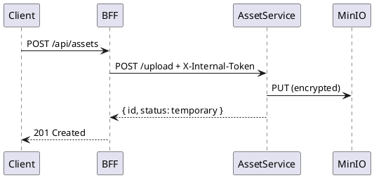

# Asset Service - Secure Storage

A secure, isolated microservice for storing and managing sensitive media assets (Images, Video, Audio) using MinIO object storage.

## Security Architecture

```
┌─────────────────────────────────────────────────────────────────┐
│                        Docker Network                            │
├──────────────┬──────────────────────────┬──────────────────────┤
│   DMZ Net    │      Internal Net        │     Storage Net      │
│              │                          │    (Isolated)        │
│  ┌────────┐  │  ┌─────────────────────┐ │  ┌───────────────┐   │
│  │ Nginx  │──┼─▶│   Gateway BFF       │─┼─▶│ Asset Service │   │
│  └────────┘  │  └─────────────────────┘ │  └───────┬───────┘   │
│              │                          │          │           │
│              │                          │          ▼           │
│              │                          │  ┌───────────────┐   │
│              │                          │  │     MinIO     │   │
│              │                          │  │  (Encrypted)  │   │
│              │                          │  └───────────────┘   │
└──────────────┴──────────────────────────┴──────────────────────┘
```

### Security Features

| Layer | Protection | Implementation |
|-------|------------|----------------|
| **Storage** | Isolation | MinIO on private `storage` network |
| **In Transit** | TLS | Docker internal network encryption |
| **At Rest** | AES-256-GCM | MinIO SSE-S3 with `MINIO_KMS_SECRET_KEY` |
| **Authentication** | Shared Token | `X-Internal-Token` header validation |
| **Authorization** | Service-only | Only BFF can reach asset-service |

## Quick Start

```bash
# 1. Start the services
docker compose up -d minio asset-service asset-gc-worker

# 2. Verify health
curl http://localhost:8002/health

# 3. Test upload (from within Docker network)
docker compose exec gateway-bff curl -X POST http://asset-service:8002/asset/upload \
  -H "X-Internal-Token: ${ASSET_SERVICE_TOKEN}" \
  -F "file=@/path/to/test.jpg"
```

## API Reference

### Upload Asset
```http
POST /asset/upload
Content-Type: multipart/form-data
X-Internal-Token: <token>

Response: 201 Created
{
  "id": "uuid",
  "status": "temporary",
  "message": "Asset uploaded successfully. Call PUT /confirm/{id} to make it permanent."
}
```

### Confirm Asset
```http
PUT /asset/confirm/{id}
X-Internal-Token: <token>

Response: 200 OK
{
  "id": "uuid",
  "status": "permanent",
  "message": "Asset confirmed and will not be garbage collected."
}
```

### Get Asset
```http
GET /asset/{id}
X-Internal-Token: <token>

Response: 200 OK
Content-Type: <original-content-type>
Content-Disposition: attachment; filename="<original-filename>"

<binary data>
```

### Delete Asset (Soft)
```http
DELETE /asset/{id}
X-Internal-Token: <token>

Response: 200 OK
{
  "id": "uuid",
  "status": "deleted",
  "message": "Asset marked for deletion. It will be permanently removed later."
}
```

### Health Check
```http
GET /health

Response: 200 OK
{
  "status": "healthy",
  "minio": "connected"
}
```

## Lifecycle Management

```
┌──────────────┐    Upload     ┌──────────────┐    Confirm    ┌──────────────┐
│   (none)     │ ──────────▶   │  temporary   │ ──────────▶   │  permanent   │
└──────────────┘               └──────────────┘               └──────────────┘
                                     │                              │
                                     │ GC (24h)                     │ DELETE
                                     ▼                              ▼
                               ┌──────────────┐               ┌──────────────┐
                               │   DELETED    │ ◀────────────  │   deleted    │
                               │  (physical)  │     GC        │   (soft)     │
                               └──────────────┘               └──────────────┘
```

### Garbage Collection

The `asset-gc-worker` runs every 24 hours and:
1. **Deletes temporary uploads** older than 24 hours that were never confirmed
2. **Permanently removes soft-deleted assets**

Race condition prevention: Before deleting, the worker re-checks each object's current status to prevent deleting assets that were confirmed between scan and delete.

## Configuration

| Variable | Description | Default |
|----------|-------------|---------|
| `MINIO_ENDPOINT` | MinIO server address | `minio:9000` |
| `MINIO_ACCESS_KEY` | MinIO access key | - |
| `MINIO_SECRET_KEY` | MinIO secret key | - |
| `MINIO_BUCKET` | Storage bucket name | `assets` |
| `ASSET_SERVICE_TOKEN` | Service auth token | - |
| `GC_INTERVAL_HOURS` | GC run interval | `24` |
| `GC_MAX_AGE_HOURS` | Max temp file age | `24` |

## Development

### Run Tests
```bash
# Install dependencies
pip install -r requirements.txt

# Run tests
pytest -v tests/
```

### View Logs
```bash
docker compose logs -f asset-service asset-gc-worker
```

## Sequence Diagram

See [asset_service_flow.puml](../../docs/asset_service_flow.puml) for the complete interaction diagram.


