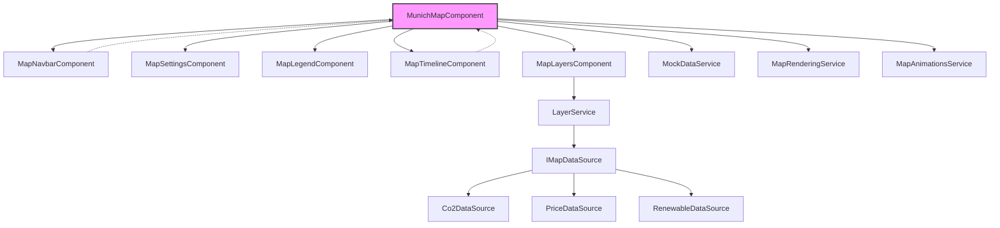

# Munich Map Application Documentation

This document provides a technical overview of the components and services within the `frontend-user` map implementation.

## Architectural Overview

The map architecture is built around the `MunichMapComponent`, which acts as a central orchestrator. It manages the state, coordinates sub-components, and interfaces with core services for data and rendering.



---

## Components

### MunichMapComponent
- **File**: `munich-map.component.ts`
- **Description**: The main orchestrator for the map view. It manages the SVG map lifecycle, coordinates data fetching based on timeline/router state, and integrates all sub-components.
- **Config Interface**: Internal `legendConfig` and `timelineConfig`.
- **Has Config**: `true`

### MapNavbarComponent
- **File**: `map-navbar.component.ts`
- **Description**: Provides a location search interface. It uses the `MockDataService` to fetch search suggestions and emits search results to the parent component.
- **Config Interface**: None.
- **Has Config**: `false`

### MapCanvasComponent
- **File**: `map-canvas.ts`
- **Description**: The background map layer utilizing MapLibre GL JS. It handles the core map rendering, tile loading, and user interactions (pan/zoom).
- **Key Features**:
  - **Zone Optimization**: Initializes and renders MapLibre outside Angular's Zone (`runOutsideAngular`) to prevent excessive change detection cycles during high-frequency events like drag or zoom.
  - **Signal Integration**: Observes `MapRenderingService.activeOverlay` via an effect (currently disabled for verification) to overlay custom SVG visualization layers.
  - **Event Bus**: Listens to `MapControlService.zoomActions$` to support external UI zoom controls (e.g., sidebar buttons).
  - **Interaction**: Configured with standard navigation controls (`dragPan`, `scrollZoom`, `boxZoom`, etc.) enabled.
- **Config Interface**: None (Internal MapLibre Config).
- **Has Config**: `false`

### MapSettingsComponent
- **File**: `map-settings.component.ts`
- **Description**: Contains floating controls for zooming and a settings popover. The popover includes theme selection (Light/Dark/System), a colorblind mode toggle, and an "About" section for the `reportNazis` platform.
- **Config Interface**: None.
- **Has Config**: `false`

### MapLegendComponent
- **File**: `map-legend.component.ts`
- **Config**: Configured via `LegendData` in `LayerSourceConfig` (see `layer.types.ts`)
- **Description**: Renders a color-coded legend bar based on the active layer's configuration.
- **Config Interface**: `LegendData`
  ```typescript
  export interface LegendData {
      title: string;          // Name
      unit: string;           // Einheit
      colorTheme: string;     // 'pollution' | 'price' | ...
      breakpoints: string[];  // Breaking Points (Labels)
  }
  ```
- **Has Config**: `true` (Signal Input from Parent)

### MapTimelineComponent
- **File**: `map-timeline.component.ts`
- **Config**: `map-timeline.config.ts`
- **Description**: An interactive timeline for navigating historical or real-time data. It features a custom range/interval selection and a draggable handle for precise time travel.
- **Config Interface**: `TimelineConfig`
  ```typescript
  export interface TimelineConfig {
      range: string;
      interval: string;
  }
  ```
- **Has Config**: `true` (Signal Input)

### MapLayersComponent
- **File**: `map-layers.component.ts`
- **Description**: A floating menu allowing users to switch between different data layers (CO2, Price, Renewables) and toggle weather overlays. It consumes the `LayerService` to stay synchronized with the application state.
- **Config Interface**: Processes configurations provided via `LAYER_CONFIG`.
- **Has Config**: `true`

---

## Data Sources & Services

### IMapDataSource & MockDataSources
- **File**: `mock-data-sources.ts`
- **Description**: Defines the interface for map data providers. The file contains mock implementations for `Co2DataSource`, `PriceDataSource`, and `RenewableDataSource`.
- **Config Interface**: `IMapDataSource`
  ```typescript
  export interface IMapDataSource {
      id: string;
      connect(): Observable<any>;
      disconnect(): void;
  }
  ```
- **Has Config**: `true`

### Dynamic Forms
- **Directory**: `dynamic-forms/`
- **Description**: A modular toolkit for generating forms dynamically from metadata models.
- **Components**:
  - `DynamicFormComponent`: Renders a full form.
  - `DynamicFormQuestionComponent`: Renders an individual input.
- **Config Interface**: `QuestionBase`
  ```typescript
  export class QuestionBase<T> {
      value: T | undefined;
      key: string;
      label: string;
      required: boolean;
      order: number;
      controlType: string;
      // ...
  }
  ```
- **Has Config**: `true`
